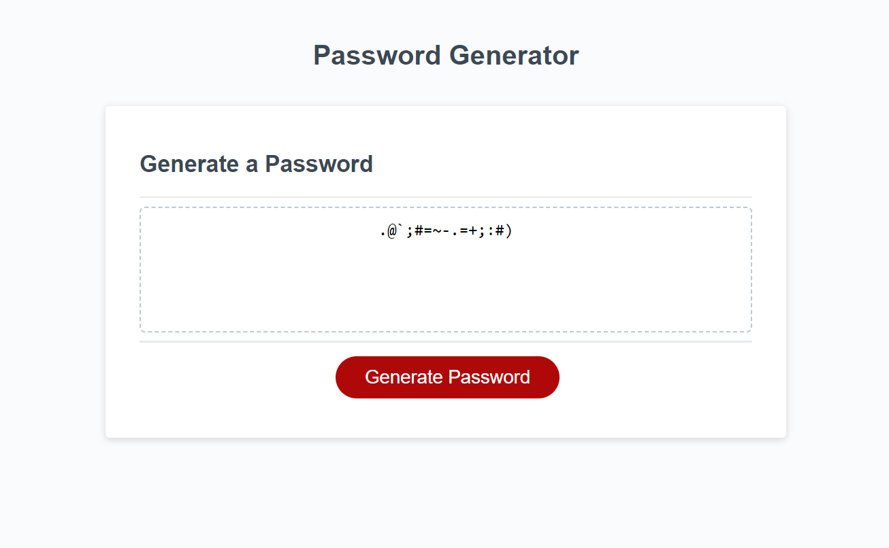

# Password-generator

Password generator is used to generate password of various length between 10 and 64

## Description

## Installation

N/A

## Usage
Password generator is used to generate password of various length between 10 and 64 . Just to keep a strong password within the branch.

## Credits

N/A

# Password Generator
Password Generator is a web application that generates a strong and secure password for users. This application is built using HTML, CSS, and JavaScript.

# Features

* Generate a password when the button is clicked.
* Presents a series of prompts for password criteria, such as length of password and character types.
* Validates each input and at least one character type should be selected.
* Password length can be between 10 and 64 characters.
* Character types include lowercase, uppercase, numeric, and special characters.
* Generated password can be displayed in an alert or written to the page.
* nstallation
* No installation is required. The application can be accessed by opening the index.html file in a web browser.

## Usage
To use Password Generator, simply click the "Generate Password" button. This will display a series of prompts to the user. The user can select the length of the password between 10 and 64 characters and can choose characters of uppercase, lowercase, numeric, or special characters.

Once the user has answered the prompts, the password will be generated and displayed in the password input field. The user can then copy the password to their clipboard or write it down.

## Why This Project
The purpose of this project is to provide a simple, yet effective, password generator that can be used to create strong and secure passwords. This is important because weak passwords can leave users vulnerable to security breaches and other forms of cyber attacks.

## What I Learned
During the development of this project, I learned important fundamentals of JavaScript. I used a combination of objects, arrays, function calls, for statements, and if statements. I learned how to call functions, return values, and many different manipulations that can be performed on objects, arrays, and numbers like Math.Floor, Math.random.

## Issues
There were a few challenges I encountered while making this password generator. I had a hard time trying to figure out how to ensure the user input a password length between 10 and 64 characters. However, with some research and experimentation, I was able to find a solution.

here were a few challenges I ran into making this password generator. I had a hard time trying to figure out how to ensure the user input a password length between 10 and 64 characters.

## License
 MIT - 2022
